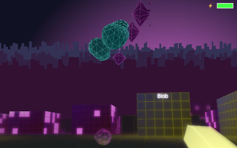

## Instructions

Strange phenomena has overtaken the city, rumour has it that there is a quarantine zone somewhere near the middle, but the route there is hardly safe.  Fortunately you've discovered an ancient Gunturion mech, but it's not exactly fuel efficient and the electricity grid is very patchy right now.
 
Shoot buildings (repeatedly) to add them to the power network. Follow the the eclipse to get to your destination. Shoot anything that gets in your way. Keep your battery charged and try not to die. 

* Shoot/turn: Mouse
* Move: WASD/Arrows
* Run: Shift
* Jump: Space

play it here http://madmaw.github.com/gunturion/dist/index.html

## Postmortem

This year I wanted to make a first person shooter for JS13K. I decided to do this for two reasons
1. The instructions on the JS13K website said it was a bad idea, and
2. I've been accused of making inaccessible, unplayable games in the past, so I wanted to do something as low-brow as possible.
I did briefly consider entering the new WebXR category (which has pretty good prizes!), however I just came off a ThreeJS project and have worked with (and been very unimpressed with) Babylon before, and I wanted to write a custom shader and do all the physics from scratch. Plus, I don't think VR is a good medium for FPS's, too much nausea. 

I'd been toying around with the idea of a first-person Geometry Wars style game and I'd been groping around for a way to constrain the area that the player cam move in. Geometry Wars has that box that the monsters can move in and out of, but the player is stuck inside. I didn't want to have a cliff that you fell off as it seemed you would just end up accidentally walking backward off the cliff all the time, and if I had a wall then monsters (and bullets) going through it would be problematic to represent. The theme solved my problem, I could have an area where you were online, and if you went offline your gun didn't work, but weren't punished by dying immediately. Seemed simple enough. 

I was fortunately enough to have most of the month off aside from some client work that added up to maybe 4 days, so I basically worked straight through on the game. I'm not a professional game developer by trade, just a regular developer, although I do TypeScript/JavaScript more than anything these days and I'm OK at math. 

### Bloom/blur/fog

My first challenge was that I wanted to add a bloom/blur effect onto the render to knock some of the hard edges off the low poly models and, at a glance, you would be able to tell the direction that stuff was moving in by its blur. Plus, that's what Geometry Wars does. I did some web searching and the few tutorials I found were saying a double (or triple!) render was required, one to get the original image, one to boost the lighting, and one to combine the two images. This seemed like it would be quite inefficient and would require a couple of shaders to get it to work. I eventually realized I could blur the current frame against the previous render frame, offset by the previous projection, to get the blur effect. The bloom comes for free because over a series of frames, light areas get lighter and lighter and dark areas stay about the same. It hardly comes for free though, the WebGL code has to render to a texture then that texture gets dumped into a canvas. In the finished game, these two steps take up around 50% of the processing on my (dog slow) machine. 

I decided I also wanted closer objects to be more in focus. To achieve this I made my pre-existing fog effect blend everything to transparency instead of a fog colour. This way distant objects are transparent instead of fading to a colour. This means the shader can reason about the distance of objects in the previous frame by looking at the (hithero unused) alpha value. The actual fog is added after you copy the pixels onto the canvas and meant I could do a skybox outside of WebGL (more on this later). It also meant that the bloom/blur effect would ignore brightly coloured fog, so wouldn't white-out the entire screen if you wanted to use white fog. By default WebGL does not interpolate alpha, but this approach meant I couldn't turn it on and have translucent objects in my scenes because the combined values would throw off the distance/fog calculations. No big deal in this game. 

### Procedurally generated meshes

I wanted to have a big variety of monsters, each with individual behaviours that the player can learn, predict, and get that "Oh no, not these guys!" feeling. I figured the best way to do this was to have a seed for each monster that consistently produces the same monster everytime it is used. On top of this, I wanted to use the same code that generates enemies to generate most of the other models used in the game (except surfaces). In order to coax it into producing certain behaviours, I used a combination of bitwise operations and a seeded Random Number Generator, instead of a straight up RNG. For example, monsters that have the first bit of their seed as 0 can fly. 

Figuring that spherical physics is going to be fairly straightforward, I wanted my monsters to be roughly spherical, but also visually distinctive enough that the player can tell them apart. The code is actually quite simple, if you select a number of lines of latitude and longitude you are going to use, then generating a spherical model falls out pretty eassily. To add a bit more variety I randomly offset every second line and have a spikey point on the end. 

Finally, I wanted the monsters to be animated. I knew that generating individual frames for each mesh wasn't a good idea, so I decided to do it in the shader. Each point has a secret animation offset attached to it, which when multiplied by the game time and sin'd gives you a nice wave effect. Sometimes it combines in interesting ways to make the monsters an organic kind of feel, sometimes it looks a bit crap, but that's procedural generation for you. 

### Explosions

Additionally I wanted the monsters to explode when shot. Originally I was going to split them into individual particles and turn them into a cloud of separate objects. However I didn't want to introduce a new entity type. I went with the option of making the monsters just explode and a single mesh. Making the individual vertices just expand outward looked too regular, so I had to add a separate attribute which is a randomly generated offset that is multiplied by an explosion factor (which is 0 while the monster is alive) when exploding. The individual trianges also need to shrink to nothing as they are exploding outward, so the code needed to juggle the explosion factor and the overall models scale to achieve this effect. 

### Lines

Everything in Geometry Wars is defined by thick, neon lines. I figured my simple models (which I wasn't planning on having lighting normals on) would need something similar. I was going to double render each model, one with gl.TRIANGLES and one with gl.LINES to achieve this effect. The approach had a lot of problems however, offsetting the lines so they are visible outside the meshes is actually quite difficult and scaling them with perspective is basically impossible. Fortunately someone did an article on Barrycentric Coordinates, which you can read here 

http://codeflow.org/entries/2012/aug/02/easy-wireframe-display-with-barycentric-coordinates/

I don't claim to understand the math, but it works and looks fairly convincing and, because it is done in the shader, you can do all sorts of cool stuff. 

### Surfaces

Originally I was going to make the game in a series of rooms, however I really like the neon city asthetic and it seemed a better fit for the theme. I decided to make the game set in an endles city at night. I tried using the Barrycentric Coordinate code with surfaces, however it only really works on the outline of the individual triangles, and making two individual triangles for every grid (oh, the floor is going to be a grid OK) tile on the ground seemed inefficient for a lot of reasons. For this reason, surfaces have their own grid code which just draws a line every time the x/y value is a whole number (or close to). 

This also fed nicely into making lights on the side of buildings, you can just index into an array of booleans based on your grid coordinate and adjust the lighting of the t...oh wait, WebGL doesn't allow arbitrary indexing into arrays?! OK what if I used an integer and used bitwise operations to...oh wait, GLSL doesn't have bitwise operations?! OK, what if I pass in a float and use pow(x,2) and divide to simulate the bitwise operations that I need? OK that seems to wor...oh wait, there's something weird that happens for values larger than 24 bits, maybe some kind of rounding error?! OK, what if we broke up our integer into an array of 4 floats, maximum 24 bits per float, which we iterate through and shift down? Yeah that seems to work.

In hindsight, I probably should have either just had a blanket rule that surfaces can't be larger than 24 tiles or just had an array of booleans that I iterated through. Oh well, it works and now I have lights.

### Physics

The only collisions I really need to worry about are those between a surface and a sphere. This is actually quite simple to do for a plane, somewhat more difficult for edge cases where the sphere hits the edge of a surface. To be honest it all went much smoother than I expected. There are still a couple of unexplained situations where spheres will hit the same surface multiple times in the same update (which should never happen) or start an update inside a surface (which should also never happen), but neither of those things seem to actually cause problems in game, just eat up CPU cycles. 

I noticed that monsters tended to bunch up, and I figured I would also add sphere physics, which is also notoriously easy to do, to avoid this. However it was causing all kinds of problems and I couldn't work out why. Eventually I realised that, because surfaces never move, I was doing all my physics in one pass, however spheres are bouncing everywhere so the situation where you move a sphere back into another sphere, that has already done its collision checks, was very common and then weird behaviour started. It then occurred to me that the enemy AI could just detect a collision with any other enemies and adjust its velocity to move away. 

### AI

Like the models, the AI is based off the seed supplied to the monster generator. Essentially there are whole bunch of behaviours that a monster can have (like follow player, move randomly, dodge bullets, die, jump, spin around, etc...) as well as some conditionals that effect behaviours (do after N seconds, do if the aggo is high, do when close to player) and we randomly combine them to produce a simple AI. I think it works quite well, although because I wanted the game to be challenging, most monsters need to seek the player out in one way or another. 

### Level generation

I wanted the levels to go up hill, mostly so the buildings converged with the horizon of the skybox in a believable way. This had the unintentional consequence of ramps being a very precious commodity. It also illustrates the value of having the higher ground. 

### Skybox

I had a flat colour background, however I wanted something a bit more special. I had two options 
1. have some kind of skybox in the 3D world
2. just render something on the canvas after we extract the texture from the 3D world

I went with 2, but I do wonder if 1 would have been better. For one thing, if we had a background in the 3D world, then our bloom effect would work for things in the sky. Anyway it was fairly simple, I rendered a cityscape at startup then render that under the 3D render on every frame, adjusting Y for camera position and tiling on the X axis.

I also added a moon thing so players would always know which direction to head in. 

### Normals and Lighting

To get the buildings looking a bit more 3D, I decided I did need normals after all. Then I figured I may as well add them to the monsters as well, since, why not. 

I also wanted the grid to have a glow, so I added in a value that indicated the "glowiness" of the floor where you are. It's quite subtle in the finished game, but you can see monsters and walls tend to take on the colour of the floor then are above. 

### Minification

While there are some specific things I did here, more generally I found there are two ways to make your source shorter. 

1. Look at the minified output and try to come up with ways to help the minifier (Closure in my case) make something smaller
2. Look at your code and try to find ways to make the same logic take up less space

I cannot overstate the importance of (1), there were several points where I thought I was out of space, then found a reserved word I could remove, or a minus sign I could reverse.   

#### No classes

Classes take a massive amount of space, and really don't add anything. In TypeScript you can achieve the same effect with interfaces and simple objects. I like just returning functions where possible, which is even more efficient. My regexes (see below) didn't work with classes either. 

#### Turning Closure's ES5 output back into ES6

The Closure compiler is amazing, but it only handles ES5, but the `function` declaration is longer than the equivalent `()=>` 

`function a()`
`var a=()=>`

See! 1 byte longer, and that's before the aggregate the `var`s (see below). 

I managed to write a series of regular expressions to turn all my `function`s into `()=>`s. I should say, it won't work for all code because the precdence of `()=>` is different, however if you don't use any classes in your TypeScript you might be OK. 

It would be nice to turn `for(in)` back to `for(of)`'s too, but that's beyond my ability. 

#### Using numbers instead of GL constants

Almost all of the GL constants are consistent between machines (I hope), so I looked up the values on the OpenGL website and replaced all the values with numbers. For example, 

`gl.STATIC_DRAW`

can be replaced with 

`0x88E4`

#### Array map

I have to admit, I don't usually do this one because I feel that it doesn't actually save space a lot of the time, however there was one notable example where I had a line like this

`for(let entity e of entities){update(e)}`

and I replaced it with

`entities.map(update)`

which not only is shorter, is so much more elegant. 

#### Make top-level vars global

In my JS1K entry, I took out all the `var` declarations entirely. I did try that for this game, but, while it did mostly work (?!), there was some odd behaviour at times. That said, provided you can identify the top-level var declarations and they are all assignments, then you can strip out the `var` keyword on the front and make them global. In reality it was very hard to identify them using a regex, so I left most of it alone. 

### Words on Buildings

I'd managed to get my code down to something like 13100 bytes and there was one big feature I wanted to add. I wanted to put big neon words on liberated buildings. I figured that this would help people navigate a bit better since the world is a bit sameish. Of course, I couldn't waste precious bytes on a dictionary of words, so I extracted parts of the names of attributes on `document` and `canvas`. It works pretty well, although occasionally you'll see a building called `ondragend` or something, which is a bit of a giveaway. I rendered these words in the default font (which is 10 pixels high) onto a canvas and turned that canvas into a WebGL texture. 

Because the font was so small, the words were very pixelated. Solution: turn up the lighting so high that it looks like neon light with bloom. I think it turned out pretty well.

### More Minification

#### Removing sequential var decls

I noticed that, with all my modifications to the output, I had a lot of sequential var declarations. To tidy this up, I wrote a series of regular expressions that detected and aggregated them. They got so complicated that Visual Studio Code eventually started freezing when I tested them in its regex search and the build takes about 10 minutes to execute them all. Because the Grunt regex task won't re-examine modified content, they need to be run multiple times over to catch mutiple, sequential, redundant var declarations. 

#### Local Storage

While the API doesn't say this, you can use a number as a key and a value for setItem (and getItem). So 

`setItem("x", "t")` is obviously longer than `setItem(1, 1)`

I also stopped calling `JSON.stringify` and generated my (very simple) JSON using string manipulation. I also realised that if you just use arrays, then minification wont break your `JSON.parse` call like it does with passing in maps. 

#### HTML and CSS

Seems obvious, but I aggressively removed end tags from as many elements as I could, and cut the CSS down as far as I could. Took several passes before I got it to where it ended up. Check out the files in the repo.

#### Stripping GLSL

I made a Grunt task to remove whitespace and comments from the GLSL. Unfortunately I had to reuse a whole bunch of variables to get below the space limit, so the GLSL is still quite unreadable. 

### Pre-submission rush

I have to admit, I don't think my frame of mind was good leading up to the deadline. I was tired and making a lot of mistakes. I'd played the game through a couple of times that day and found heaps of bugs, then, in fixing them, introduced other bugs. I ironed out most of them (although gun upgrades spawning child upgrades on collection was one of the bugs that slipped through - stupid emergent behaviour), however the byte count remained stubbornly 20 bytes too high. 

I remember at one point, I discovered an unused, and reserved-word, attribute `visible` on entity and I was like "Aha! This will definitely save 10 bytes!" So I removed it and the archive size went *up* by 14 bytes. On top of this I didn't seem to be able to get the correct combination of lighting, recharge rate, power radius, and charge displayed, to line up. I was zeroing in on it and thought I had it with 20 minutes to spare and the build came in on exactly 13312 bytes, so I submitted. 

The values I ended up with are right on the upper end of what I, the developer, can beat. It's brutally hard. The version here has those numbers tweaked ever so slightly, and it brings it into the realm of doable. I'd say the difficulty at the start of the game is more what I was aiming for at the end of the game! 

https://js13kgames.com/entries/gunturion-shoot-the-purple-buildings

That said I like hard games and the difficultly of the version of the JS13K site actually forces me to think instead of just sitting in the one place shooting buildings. So
1. Strategy is very important, if you attack an enemy building with a building at your back, you will die. You need to pick off the ones on the fringes and work your way to the middle
2. Kill all the monsters before attacking the building. Buildings respawn monsters slower than you can shoot, once you'd killed all the monsters only then concentrate on converting the building
3. Monsters spawn from the lights in the order the lights appear. After you'd drained all the monsters from a building, aim for the first light that appears so you immediately kill the first monster that appears. 
4. The battery powerups boost your battery, but, more importantly, lengthens your battery bar. Dying resets this
5. If you kill a big monster (not spawned from a building, just walking around), it will drop a weapon power up. Bouncy bullets can hit a building, bounce off AND kill a monster. Also some guns let you jump higher (was an emergent behaviour, but I swapped it so guns that shoot bullets that repect gravity make you jump higher, instead of vice-versa. Seemed fairer)
6. As a building gets damaged more, it will call for help from adjacent buildings. Buildings that weren't spawning when you started your attack, may start spawning. Small buildings are also easier to convert than large ones, although they generate less power too
7. If your battery goes red, you will die from then next hit. Providing there is a friendly building nearby, you should strongly consider stopping shooting until your battery is green again, then resume your attack (larger monsters do more damage, so be aware)
8. The battery charges faster while it is red
9. If you are filling your battery faster than you can drain it with bullets, you will shoot faster. This is only possible when surrounded with very large buildings
10. If you are above a building, it will spawn flying monsters, below it will spawn either, but most likely rolling/bouncing ones. Sometimes it helps to draw out all the flying monsters then jump down to the ground 
11. If you get stuck somewhere because it's too hard, backtrack and try to bring down some adjacent buildings, or open up a path somewhere else. The RNG can produce some absolutely stupid monsters in addition to some real terrors, sometimes it's just a matter of trial and error
12. The challenge at the end is intentional, but beatable with a bit of thought, maybe even in ways I didn't intend

### Final Thoughts

After having a few days to reflect and look at the feedback, I think I managed to make an inaccessible FPS. Most players don't seem to persist with attacking long enough to convert a single building, which is pretty core to the whole experience, and how the battery/gun/shield/charging works isn't clear and/or is frustrating. 

Due to the increased difficulty, I played through the entire JS13K version of the game in the days after submission to satisfy myself that it is possible to beat. I did get there, but it's really challenging, the second half is very grindy, the difficulty doesn't scale properly with some vicious monsters spawning in places and some really benign ones in others, and there was a bug where you could jump over walls if you ran at them. 

I am happy with the visuals. It would have been nice to have more neon stuff, but I think given the constraints, it looks quite good. The level design could definitely have used tunnels, which would have given the player somewhere to take shelter from monsters and limit their exposure to attacks from above (which are particularly annoying). 

Oh well, next year I'll make an inaccessible version of Cookie Clicker or something
